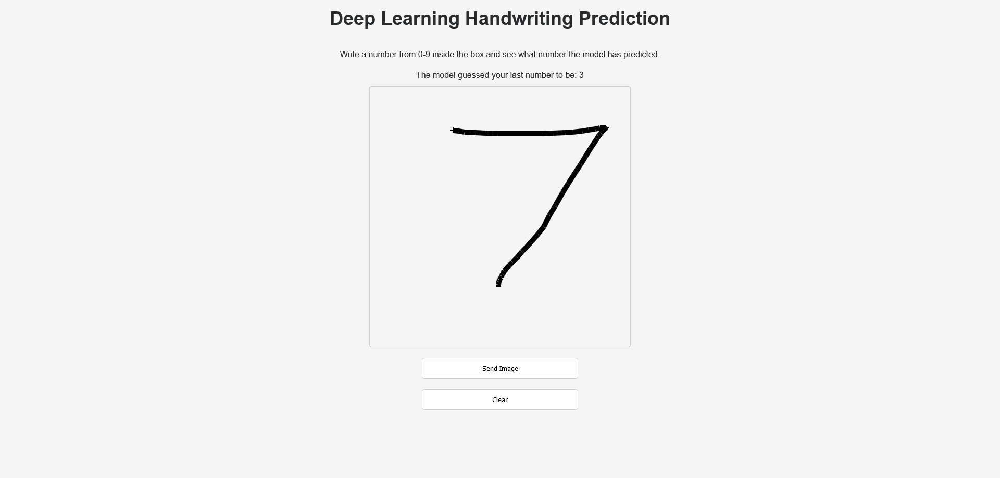
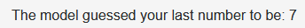

# Deep Learning Handwritten Digit Recognition App

## Description

This is a simple app that uses a deep learning model to recognize handwritten digits. The model was trained on the MNIST dataset. The app is built using HTML, CSS and JS on the client and Python with FastApi on the server.

## How to run the app

### Client

Change your directory to the client folder and run the index.html file using the vs code extension "Live Server" or any other method of your choice.

### Server

Change your directory to the server folder and run the following command:

```bash
>> pipenv install

>> pipenv shell

>> python .\main.py
```

This will start the server. Now you can head over to the client and start drawing digits and see the model predict the digit you drew.

## Conclusion

This is how the app should look like when everything is working fine:



